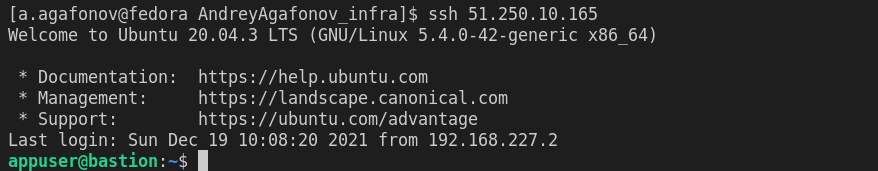
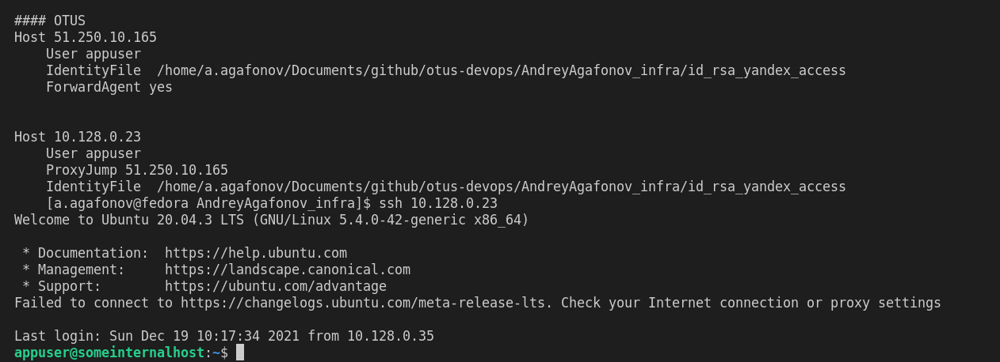
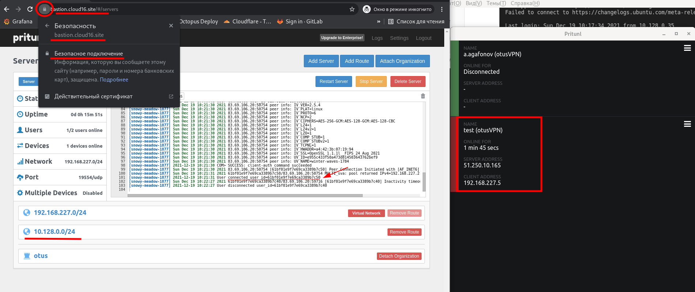
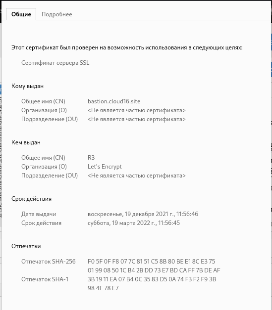
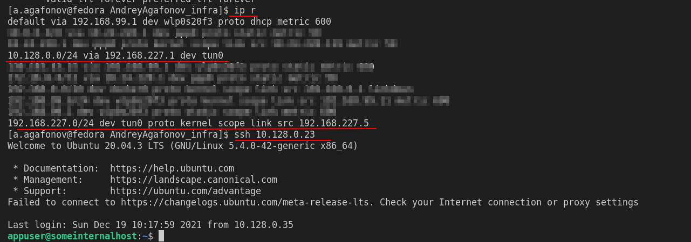

# Знакомство с облачной инфраструктурой и облачными сервисами (HW_5)


## Полное задание:

1. Выполните задание про подключение через бастион хост.

2. Добавьте в ваш репозиторий Infra (ветка cloud-bastion):

   1. файл setupvpn.sh

      **Примечание: так получилось что переносил свою группу на  попозже и видел старт нескольких групп. ( 2-х если быть точным, это 3-я). И все время группа натыкается на одну и ту же проблему, заранее нигде не описано и никто об этом не предупреждает и нет информации о том что что то  может пойти не так (если это квест или увесилительное приключение - то я только за такие сюрпризы, но не в образовательном техническом курсе за 90+ т.р.). И в этот раз то же такая же ситуация. Например setupvpn.sh описывает скрипт установки pritun для 3.4 Mongo и Ununtu xenial. При этом в репозитории  пакета pritun уже не существует, а MongoDB 3.4 - это я даже не знаю…. супер древнее:) последняя актуальная версия 5. Пометьте где нибудь хотя бы что могут быть легаси и скрытые ошибки (я понимаю что обновлять все всегда и везде треснешь, но если предупредить - то негатива будет меньше как мне кажется). Ну или обновите методичку.  можно взять мой файл, он точно работает на 20-й убунте. Проверено.**

   2. конфигурационный файл для подключения к VPN (переименуйте *.ovpn в cloud-bastion.ovpn)

3. Опишите в README.md и получившуюся конфигурацию и данные для подключения в следующем формате (формат важен для проверки!).

4. Добавьте "Labels" cloud-bastion к вашему Pull Request

   #### Задания со звездочкой:

   1. Предложить вариант решения для подключения из консоли при помощи команды вида ssh someinternalhost из локальной консоли рабочего устройства, чтобы подключение выполнялось по алиасу someinternalhost и внести его в README.md в вашем репозитории
   2. С помощью сервисов https://xip.io//https://letsencrypt.org/ и реализуйте использование валидного сертификата для панели управления VPN-сервера

   ## Решение:

### Инфраструктура:

Для выполнения домашнего задания в Ya Cloud созданы 2 вирутальные машины


Приватная сеть 10.128.0.0/24

  Outputs:
bastion_IP = 51.250.10.165
someinternalhost_IP = 10.128.0.23

Созданы пользователи 'appuser' на каждой машине и добавлены ssh ключи(приложены к репе).

5%CPU более недоступно для создания. Создавал намеренно 100% для bastion и побольше RAM - потому что первая  инициализация  работает очень медленно.

### Организация подключения к машинам:

Сразу опиши способ подключения одной строкой(задание со звездочкой). Для этого можно использовать proxyJump. Подготовим нашу хостовую машину и изменим конфигурационный  файл ~/.ssh/config:

```bash
Host 51.250.10.165
    User appuser
    IdentityFile  "{path_to_ssh_bastion_key}"
    ForwardAgent yes


Host 10.128.0.23
    User appuser
    ProxyJump 51.250.10.165
    IdentityFile  "{path_to_ssh_mongo_key}"
```

И этого достаточно для подключения в нашим машинкам.

1. подключаемся к bastion

   

2. Подключаемся к машинке внутри сети используя бастион хост:


   

При желании использовать короткое понятно имя - в файл hosts (/etc/hosts) добавить запись вида
`10.128.0.35 somehost`, скорректировать соответствующим образом файл config и подклчючение производить уже используя имя, либо если это происходит в рамках рабочей схему - конечно же использование DNS.

---

К репозиторию приложен файл [setupvpn.sh](setupvpn.sh)

Конфигурационные файл для OPNVPN - [cloud-bastion.ovpn](cloud-bastion.ovpn)

---

## OpenVPN server

На адресе [https://bastion.cloud16.site](https://bastion.cloud16.site)   развернут VPN сервер, так же настроен https сертификат.
Согласно заданию создан пользователь test с необходимым PIN.

На снимке видно, что настроен VPN сервер и имеется активное соединение (слева), добавлен маршрут для нашей внутренней сети и подключенный сам клиент(справа), а так же сертифик Let'sEncrypt(снимок ниже:






Проверяем подключение к машинке внутри локальной сети:

*примечание:*  по умолчанию на Fedora 35 клиент Pritun добавляет маршрут  по умолчанию через VPN туннель. Я считаю, что это не правильно, поэтому немного изменена конфигурация сервера - прописан отдельно маршрут только на внутреннюю сеть.

Команда для проверки: `ssh -i {path_to_ssh_key} appuser@10.128.0.23`


